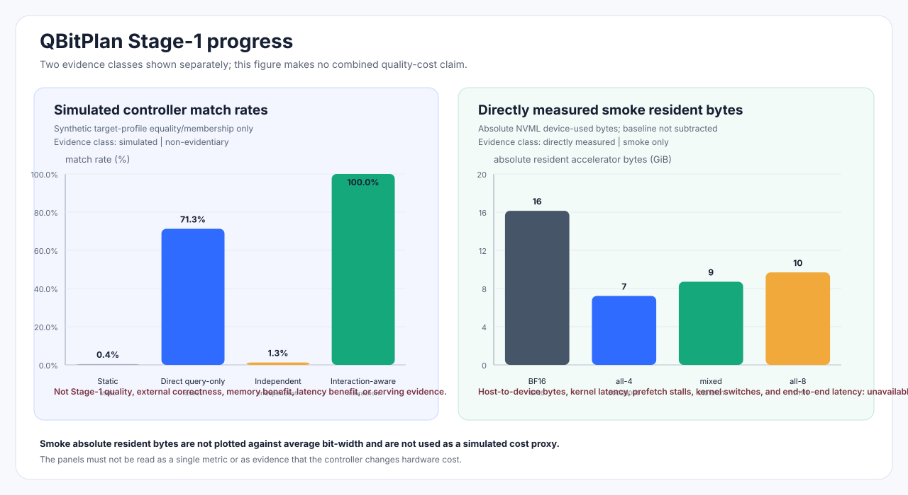

# Stage-1 progress report — 2026-08-05

This is a local-only progress record for the current implementation slice. It
keeps simulated controller behavior separate from directly measured smoke
resident bytes. It is not a Stage-1 gate report and does not claim quality,
cost, latency, or serving benefit.

## 1. Controller reproduction

The accepted deterministic controller prototype was rerun with seed `20260805`
and the current committed source SHA `7ec84ad56009e6506701fde9d02e6662a38eea18`. The fixture remains synthetic:
it constructs target profiles and reports exact target-profile equality/membership.
It does not use the real `P_exec`, external correctness, an LLM, quantized
weights, or GPU execution.

| Selector | Synthetic target-profile match rate |
| --- | ---: |
| Static | 0.39% |
| Direct query-only | 71.29% |
| Independent | 1.27% |
| Interaction-aware | 100.00% |

A same-environment repeat produced byte-identical query manifest, predictions
CSV, metrics JSON, and SVG. The checked-in prototype summary remains a
historical artifact; the new local run is under
`artifacts/controller-prototype-20260805-attempt-02/`.

## 2. Profile inventory progress

The current CPU-first, profile-major full inventory plan was materialized with
new attempt identity `issue32-functional-quality-20260805-03`, artifact root
`artifacts/issue32-functional-quality-20260805-attempt-03/`, 256 canonical
profiles, two permitted non-final MATH queries, and GPU UUID
`GPU-01fe0496-2d96-9bad-bca2-935ad704d1c7`. The exact plan validates under the
current `ExperimentPlan` contract.

The real run was started with the accepted controls and a 1,800-second command
wall-clock limit, but did not seal a bundle before timeout. The created run
identity was `bdd41f652a8a5b587aaa3a4eb407d96f4b87c4507edc3a76a072ed137f5b236e`,
and no artifact index or profile outcome file was sealed. It is therefore an
`incomplete` operational attempt, not a negative scientific result and not a
new `P_exec` claim. No control was relaxed, no OOM retry was performed, and no
profile was substituted. The partial attempt remains immutable; a retry must
use a new attempt identity and artifact root.

For distinction:

- Historical all-profile attempt `c044b28a...` (producer SHA
  `b1f0462053af8a21a6015b977ed05104983a3e84`) recorded `P_exec = []` after OOM-class exclusions. That is the
  old pre-CPU-first inventory and is not the current state.
- The newer four-profile smoke run `f7d1e51c...` (producer SHA `d16ffb4eddc0b622cf8075e0116e4ddbaffb409f`)
  completed BF16, all-4, all-8, and mixed execution for both permitted smoke
  queries. Smoke completion is executable-path evidence only; it does not
  establish the full 256-profile `P_exec`.

## 3. Directly measured smoke memory

The smoke artifact directly measured **absolute** NVML device-used bytes. The
pre-attempt baseline was `477,822,976` bytes and was not subtracted.

| Variant | Peak absolute resident accelerator bytes |
| --- | ---: |
| BF16 | 17,334,009,856 bytes (16.14 GiB) |
| all-4 (`00000000`) | 7,758,413,824 bytes (7.23 GiB) |
| mixed (`01010101`) | 9,354,346,496 bytes (8.71 GiB) |
| all-8 (`11111111`) | 10,400,825,344 bytes (9.69 GiB) |

These values are directly measured smoke observations, not controller results,
not full-inventory results, and not a claim of a general memory benefit. The
figure does not place average bit-width on a memory axis.

The smoke artifact did not measure or provide accepted coverage for
host-to-device bytes, kernel latency, prefetch stalls, kernel switches, or
end-to-end latency. Those dimensions are shown as unavailable rather than
zero or imputed.

## 4. Typed artifact adapter

`qbitplan.stage1.controller_artifacts.Stage1ControllerArtifactAdapter` maps
validated profile-inventory, query-feature, target-set, and causal-prefix
artifacts into the existing `Profile`, `QueryFeatures`, `TrainingQuery`, and
`PrefixContextProvider` interfaces. It preserves empty target sets, rejects
final/unsupported phases and lineage mismatches, requires target profiles to be
in `P_exec`, and raises on a missing causal prefix instead of synthesizing a
fallback context.

The adapter is an input seam only. It adds no MLP, GRU, attention router, cost
scalar, or fallback profile.

## 5. Provenance and hashes

| Artifact | SHA-256 |
| --- | --- |
| Controller query manifest | `cc1dc7e764dac4d97a2865773d55dd1e1960f59d82b02429d45d861d76e5376e` |
| Controller predictions CSV | `31936dad538bdd91d8047bb5ea946d4afd4a7d1d0224b9a481c74884502fb32d` |
| Controller metrics JSON | `39b692799a8e346fad115a7a37776323c269411559351b8aa6fcb0af20fbae20` |
| Controller SVG | `fba5d74625cf31f96a5efea4ea06ccdceb7b12991006eb761851e0462925e561` |
| Smoke summary | `3b6d0d20113c6ac8f76b2dcb2f49f6bffeefe110c9970864c1ba14531076031d` |
| Smoke bundle JSON | `1353a5edb27cda739eeb1e87714d271c5d753b9aacf8a07570aea48fe176bbb3` |
| Current inventory input plan | `9510b454067414108b61cca9cdd747ac06697aacaf24fabcca00d0898da75bb0` |
| Current incomplete-attempt observation | `42fba65c59b7690fbf68172f659dc407ce5ff37e65f18cc23b2996054d1f4b1b` |
| This figure | `0a7dfb4da3012124e6ba03d2f1937b2ad8f3b4d7b81daf67b0e27da552e89eab` |

The report's source artifact identities are local-only paths and remain
write-once. The full current inventory remains unresolved until a fresh,
adequately bounded attempt seals all 256 profile outcomes.

## Next falsification-first experiment

Run the same validated 256-profile CPU-first/profile-major functional-quality
plan on a fresh immutable attempt root and identity, with no changed hardware,
software, decoder, determinism, profile list, query set, or failure controls.
The first falsification check is whether all 256 profiles complete preparation
and the two required forwards without OOM or operational timeout. Only a
sealed complete inventory may establish `P_exec`; then build target sets from
external correctness under `epsilon = 0.01`. Do not use this smoke memory panel
or the synthetic match rates as substitutes.
