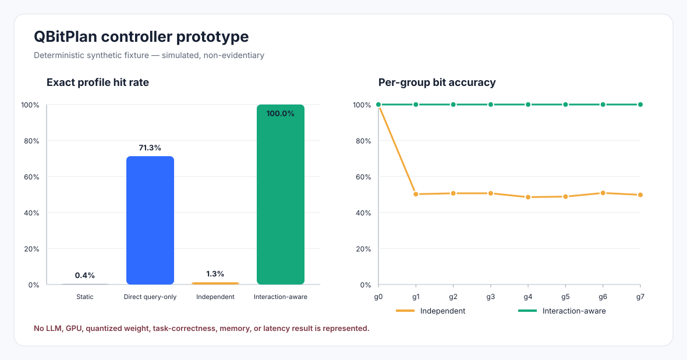

# Controller prototype: accepted Stage-1 baselines

Status: **engineering prototype**

Evidence class: `simulated`

Evidentiary status: `non-evidentiary`

Date: 2026-08-05

Reproducible seed: `20260805`

## Evidence

**Evidence.** The accepted Stage-1 execution contract specifies three first
selector implementations before any later learned router architecture:
query-only direct profile scoring, an additive independent per-group baseline,
and an interaction-aware sequential planner that may use only the actually
executed prefix and its causal hidden-state summary.

**Evidence.** The historical all-profile inventory from issue #32 recorded an
empty `P_exec` after OOM-class exclusions (run
`c044b28a8296cf96aaa2c2642b96efd557ceec6df59dafe35b30a95361f6e285`, producer
SHA `b1f0462053af8a21a6015b977ed05104983a3e84`). That is the old pre-CPU-first
attempt, not the current state wording for the repository.

**Evidence.** A newer CPU-first four-profile smoke run completed BF16, all-4,
all-8, and mixed executable paths for both permitted smoke queries (run
`f7d1e51c2819a2f7e36fa9ae3782f6897b6153da3669a83dadc9e05a26bb3147`, producer
SHA `d16ffb4eddc0b622cf8075e0116e4ddbaffb409f`). Smoke completion is
non-evidentiary executable-path evidence; it does not establish the full
256-profile `P_exec` or real profile target sets. The current full CPU-first
inventory attempt is documented separately and remains incomplete.

**Evidence.** This prototype therefore runs only on a deterministic synthetic
fixture with 2,048 training queries, 1,024 validation queries, eight binary
layer-group decisions, and all 256 analytical profiles. It does not load an
LLM, quantize weights, execute a GPU kernel, judge task correctness, or measure
any cost dimension.

**Evidence.** On the constructed fixture, synthetic target-profile match rates
are 0.39% for the static profile, 71.29% for direct query-only scoring, 1.27%
for the additive independent baseline, and 100.00% for the causal interaction-aware
planner. These values compare each selected profile with the fixture's constructed
synthetic target-profile equality/membership. They are not Stage-1 feasible-set
membership, external task correctness, or estimates of QBitPlan performance.



## Inference

**Inference.** Implementing the accepted OLS baselines now reduces architectural
uncertainty without bypassing the scientific gates. The code establishes the
selector interfaces, deterministic tie rules, executable-profile constraints,
causal prefix boundary, paired bootstrap helper, and plot pipeline that later
real artifacts can exercise.

**Inference.** A MoE-style learned router, MLP, GRU, or attention controller is
premature. Until `P_exec`, functional-quality records, epsilon-feasible sets,
and per-query target sets exist, such a network could only learn synthetic or
leaked labels and would not answer the accepted signal or interaction question.

**Inference.** The synthetic interaction advantage is deliberately built into
the fixture. It proves representational reachability and causal plumbing, not
that interaction is present in Llama-3.1-8B quantization outcomes.

## Proposed Design

### Public types and data contracts

**Proposed Design.** `QueryFeatures` accepts normalized structural features
`structural: float32[S]` and an L2-normalized query embedding
`embedding: float32[E]`. It returns the concatenated causal query vector
`x: float32[S+E]`. Construction occurs before any Transformer group executes.

**Proposed Design.** `TrainingQuery` accepts a stable query ID, one
`QueryFeatures` instance, and a set-valued tuple of executable target profiles.
Each profile has shape `[G]` with entries in `{4, 8}`. Empty target sets remain
valid all-zero examples for query-only selectors.

**Proposed Design.** `PrefixContextProvider(query_id, prefix)` returns a causal
hidden summary `u_g: float32[E]` only for the already executed prefix of length
`g`. The provider is never called for `g=0`; no future group state is part of
its interface.

### Module specifications

| Module | Inputs and tensor shapes | Outputs | Training target and loss | Runtime cost | Causal availability | Failure modes | Required ablations |
|---|---|---|---|---|---|---|---|
| Direct profile scorer | `X: [N,D]`, executable profiles `P_exec: [P,G]` | weights `W: [D+1,P]`; one selected profile `[G]` | Fixture target `Y[q,p]=1` iff profile `p` is in the constructed synthetic target set; minimum-norm OLS, mean squared error | Fit: least-squares on `[N,D+1] -> [N,P]`; selection: `O(DP)` | Query-only, before group 0 | empty executable set, duplicate profile, target outside `P_exec`, shape mismatch, non-finite input | structure-only; embedding-only; remove intercept; canonical-tie stress test |
| Independent group scorer | `X: [N,D]`, profiles `[P,G]` | weights `W: [D+1,2G]`; additive bit scores `[G,2]`; one executable profile `[G]` | Synthetic target support `Y[q,g,b]=1` iff a constructed target profile supports bit `b` at group `g`; minimum-norm OLS, mean squared error | Fit: least-squares on `[N,D+1] -> [N,2G]`; selection: `O(DG+PG)` | Query-only, before group 0 | same input failures; no executable maximizer is invalid rather than substituted | compare against direct scorer; remove structural features; remove embedding; unconstrained per-group argmax versus executable-profile-constrained argmax |
| Causal interaction planner | At group `g`: structural `[S]`, query embedding `[E]`, causal hidden state `[E]`, product `[E]`, prefix one-hot `[2g]`; feature width `D_g=S+3E+2g` | per-group weights `W_g: [D_g+1,2]`; ordered decisions and selected profile `[G]` or explicit invalid reason | synthetic target bit support for each observed `(query, target-prefix)`; minimum-norm OLS, mean squared error | Fit: one least-squares solve per group over observed target prefixes; scoring: `sum_g O(D_g)`; current Python continuation scan: `O(PG^2)` worst case, reducible to `O(G)` prefix-index lookups | `u_g` and prefix bits exist only after groups `<g` execute; future states and outcomes are unavailable | no executable continuation, unsupported target prefix, context dimension mismatch, non-finite context, final profile not executable | query-only interaction model; remove hidden state; remove query-hidden product; remove prefix bits; shuffled-prefix negative control; non-causal future-state leakage test that must be rejected |
| Static selector | feasible profiles and one mean cost vector `[J]` per profile | one canonical Pareto-minimal profile `[G]` | no learned target; strict componentwise Pareto filtering, then canonical ID tie | `O(P^2J)` | Frozen from permitted training evidence before validation | empty feasible set, missing cost vector, inconsistent cost dimensions, non-finite cost | alternate deterministic tie only as a diagnostic; never validation-selected |
| Paired bootstrap | paired synthetic target-profile match arrays `[Q]` | point estimate and percentile 95% interval | query-level resampling with NumPy PCG64; no fitting target | `O(RQ)` time and `O(BQ+R)` memory with batched draws | Post-evaluation analysis only; cannot influence fitting | unequal or empty arrays, non-finite values, invalid replicate or batch count | seed replay; paired versus intentionally incorrect unpaired diagnostic |

### Synthetic fixture

**Proposed Design.** The fixture maps the eight signs of a query embedding to an
ordered profile. Group 0 uses the query sign directly. Each later group uses the
current query sign multiplied by the sign encoded by the previously selected
bit. The causal context provider reports only that previous selected bit.

**Proposed Design.** This construction creates a falsification-friendly contrast:
the direct profile scorer may learn some whole-profile structure, the additive
independent baseline cannot represent the recurrence after group 0, and the
interaction planner can represent it from the actual prefix. The test asserts
only those engineered properties. The fixture target is a synthetic profile, not
the accepted Stage-1 feasible set plus externally judged correctness.

**Proposed Design.** Analytical synthetic cost vectors increase monotonically
with the number of 8-bit promotions, so the static selector deterministically
freezes all-4. Average bit width is reported only as a routing diagnostic; it is
not interpreted as resident memory, transfer bytes, kernel latency, or
end-to-end latency.

### Artifacts and commands

**Proposed Design.** Generate each raw artifact set in a new, empty run
directory. The runner refuses to overwrite a non-empty directory and records
the full committed source SHA:

```bash
RUN_DIR=artifacts/controller-prototype/<unique-run-directory>
python -m scripts.run_controller_prototype \
  --output-dir "$RUN_DIR" \
  --seed 20260805 \
  --source-git-sha "$(git rev-parse HEAD)"
```

The accepted artifact-generation environment is Python 3.12.3 with the pin in
[`requirements/accepted-python3123-numpy210.txt`](../../requirements/accepted-python3123-numpy210.txt).

**Proposed Design.** Run the focused checks with:

```bash
PYTHONPATH=. pytest -q tests/test_controller_prototype.py
```

**Proposed Design.** The command writes:

- `query-manifest.json`: deterministic train and validation query IDs;
- `predictions.csv`: one synthetic target and four selected profiles per query,
  with per-row v2 schema, `simulated` evidence class,
  `non-evidentiary` status, and claim-boundary labels;
- `metrics.json`: v2 evidence/status labels, synthetic target-profile match
  rates, complete provenance, per-group bit accuracy, unrounded training MSE,
  and paired bootstrap intervals;
- `controller-prototype.svg`: the report figure with visible simulated and
  non-evidentiary labels.

## Decision and claims records

**Proposed Design.** The durable assumptions, rejected alternatives, unresolved
questions, evidence requirements, and prototype claims are recorded in the
[controller prototype ledger](controller-prototype-ledger.md).
